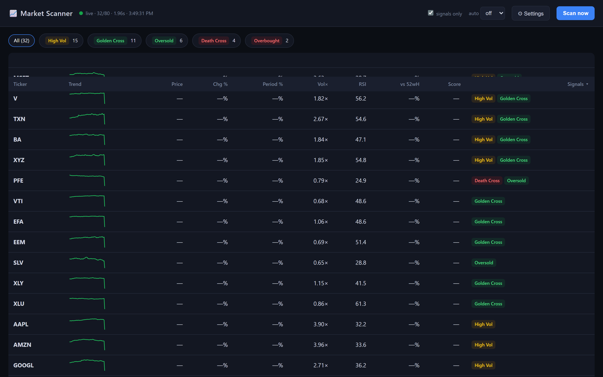

# 📈 Market Scanner

### A fast, local market screener — daily signals, sparklines, and ranked opportunities in one clean dashboard.

### [▶️ Get it on Gumroad](#) &nbsp;`[Buy link — coming soon]`

  

---

## What it does

Market Scanner downloads daily OHLCV data for a configurable universe of tickers (via **yfinance** — no API key), computes a full suite of technical signals, and surfaces the day's opportunities in a clean, sortable web dashboard. Signal badges, trend sparklines, RSI and volume metrics, filter chips, and per-ticker detail charts — all running entirely on your own machine.

## Who it's for

Active traders and investors who want a fast, private screen over *their* watchlist every morning — without a brokerage terminal, a monthly data subscription, or sending their universe to a third-party server. Tune the tickers and thresholds once and it's yours.

## Features

- **A full signal suite per ticker** — gainers/losers, momentum, unusual volume, golden/death crosses (SMA 10/30 and 50/200), RSI overbought/oversold, near 52-week highs/lows, and 20-day breakouts/breakdowns.
- **Composite score ranking** — bullish positive, bearish negative — so the most interesting names rise to the top.
- **Sortable table** with signal badges, trend sparklines, RSI and volume at a glance.
- **Click-through detail charts** — a price + dual-SMA chart and all metrics for any ticker.
- **Live controls** — *Scan now*, signals-only toggle, auto-refresh (60s / 2m / 5m), and signal filter chips.
- **Fully configurable** — edit the universe, every threshold, and which signals are enabled right in the UI (or in `config.json`); changes are saved and re-scanned.
- **Fast and polite to the data source** — one batched download per scan, an on-disk cache with TTL, and graceful degradation to cached data on rate-limit or network errors (the header dot shows live / cache / error).

## Screenshots

*The dashboard — a sortable results table with signal badges, trend sparklines, RSI and volume metrics, signal filter chips, and a live data-source indicator. Click any row for a per-ticker detail card with a price + dual-SMA chart.*

## How it works

A Flask backend serves a single-page HTML/JS frontend. Each scan pulls one batched price download for the whole universe, runs it through the screening engine (indicators + signal rules + composite scoring), and returns JSON the dashboard renders instantly. An on-disk cache with a short TTL keeps repeated scans and chart views snappy and avoids hammering the data source. A small JSON API (`/api/scan`, `/api/chart`, `/api/config`, `/api/health`) makes it scriptable too.

## Tech stack

`Python 3.12` · `Flask` · `yfinance` · `pandas` · `numpy` · `waitress` · vanilla HTML/CSS/JS frontend (no framework)

---

## ▶️ Get Market Scanner

`[Buy link — coming soon]` — a Gumroad listing for this tool isn't live yet.

*This is a showcase repository — it contains the product overview and screenshots only. The full source is available with your purchase.*

 

**Built by Hugo Kuznicki**

[🌐 Website](https://kuznickicapital-ship-it.github.io/personal-site/) · [📰 Newsletter](https://hugos-newsletter-e0c067.beehiiv.com/) · [𝕏 @Kuznickihugo](https://x.com/Kuznickihugo)

If my tools save you time, you can [💜 sponsor my work on GitHub](https://github.com/sponsors/kuznickicapital-ship-it).

> **Disclaimer:** Market Scanner is a research and screening tool, not financial advice. It surfaces technical signals for your own analysis — always do your own due diligence.
